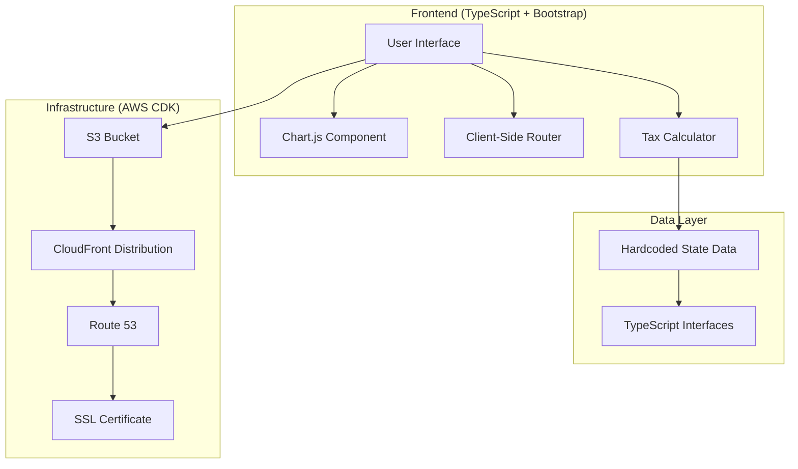

# Mountain Taxes - Design Document

## Overview

The Mountain Taxes is a TypeScript-based web application built with Bootstrap v5.3 that provides interactive visualization of state earned income tax obligations. The application uses Chart.js for dynamic line charts, allowing users to compare tax burdens across different states and income levels. The system is designed as a single-page application (SPA) with client-side routing and hardcoded tax data for optimal performance.

The application serves two primary use cases:
1. **Interactive Tax Comparison**: Users can visualize and compare tax obligations across multiple states using dynamic charts
2. **Detailed State Information**: Users can access comprehensive tax bracket information for individual states

## Architecture

### High-Level Architecture



### Component Architecture

The application follows a modular component-based architecture:

- **Main Application**: Entry point and routing coordination
- **Chart Component**: Manages Chart.js visualization and user interactions
- **State Selector**: Handles state selection and management
- **Tax Calculator**: Performs tax calculations based on state data
- **State Detail View**: Displays comprehensive state tax information
- **Data Models**: TypeScript interfaces for type safety

## Components and Interfaces

### Core TypeScript Interfaces

```typescript
export interface State {
    name: string;
    filingType: FilingType[];
    dependentDeduction: number;
}

export interface FilingType {
    type: FilingTypeName;
    standardDeduction: number;
    personalExemption: number;
    taxBrackets: TaxBracket[];
}

export enum FilingTypeName {
    Single = "Single",
    Married = "Married"
}

export interface TaxBracket {
    bracket: number;
    rate: number;
}

export interface ChartDataset {
    label: string;
    data: number[];
    borderColor: string;
    backgroundColor: string;
    tension: number;
}

export interface TaxCalculationResult {
    income: number;
    taxOwed: number;
    effectiveRate: number;
    marginalRate: number;
}
```

### Component Interfaces

#### Chart Component
- **Purpose**: Manages the Chart.js line chart visualization
- **Responsibilities**: 
  - Render interactive tax comparison charts
  - Handle income range adjustments
  - Manage multiple state datasets
  - Update chart data dynamically

#### Tax Calculator
- **Purpose**: Performs tax calculations for given income and state
- **Responsibilities**:
  - Calculate tax owed based on brackets and deductions
  - Handle different filing types
  - Compute effective and marginal tax rates
  - Validate income inputs

#### State Manager
- **Purpose**: Manages state selection and data retrieval
- **Responsibilities**:
  - Track selected states
  - Provide state data access
  - Handle "All states" and "Remove all" operations
  - Maintain state selection UI state

#### Router Component
- **Purpose**: Handles client-side navigation
- **Responsibilities**:
  - Route between main chart view and state detail pages
  - Manage browser history
  - Handle deep linking to specific states

## Data Models

### State Tax Data Structure

The application uses hardcoded state tax data derived from the Tax Foundation's 2025 state income tax rates. Each state contains:

- **Basic Information**: State name and dependent deduction amount
- **Filing Types**: Separate tax structures for Single and Married filing statuses
- **Tax Brackets**: Progressive tax rates with income thresholds
- **Deductions**: Standard deductions and personal exemptions per filing type

### Sample State Data

```typescript
const exampleState: State = {
    name: "Colorado",
    dependentDeduction: 1000,
    filingType: [
        {
            type: FilingTypeName.Single,
            standardDeduction: 12950,
            personalExemption: 0,
            taxBrackets: [
                { bracket: 0, rate: 0.0440 }
            ]
        },
        {
            type: FilingTypeName.Married,
            standardDeduction: 25900,
            personalExemption: 0,
            taxBrackets: [
                { bracket: 0, rate: 0.0440 }
            ]
        }
    ]
};
```

### Chart Data Model

The Chart.js integration uses datasets that contain:
- **Income Points**: X-axis values representing earned income levels
- **Tax Calculations**: Y-axis values showing computed tax obligations
- **Visual Properties**: Colors, line styles, and labels for each state
- **Metadata**: State names and calculation parameters

## Infrastructure Optimizations

### Current CDK Infrastructure Analysis

The existing infrastructure provides a solid foundation but requires optimization for the TypeScript SPA:

**Current Setup:**
- S3 bucket with website hosting
- CloudFront distribution with SSL certificate
- Route 53 DNS configuration
- Deployment automation

**Required Optimizations:**

1. **Build Process Update**: Modify deployment to handle TypeScript compilation and npm build process
2. **SPA Routing**: Configure CloudFront error responses to support client-side routing
3. **Caching Strategy**: Optimize cache policies for static assets vs. dynamic content
4. **Compression**: Enable gzip compression for TypeScript/JavaScript bundles

### Updated Infrastructure Configuration

```csharp
// Enhanced error responses for SPA routing
ErrorResponses = [
    new ErrorResponse { 
        HttpStatus = 403, 
        ResponsePagePath = "/index.html", 
        ResponseHttpStatus = 200, 
        Ttl = Duration.Minutes(0) 
    },
    new ErrorResponse { 
        HttpStatus = 404, 
        ResponsePagePath = "/index.html", 
        ResponseHttpStatus = 200, 
        Ttl = Duration.Minutes(0) 
    }
]
```

### Build Process Integration

The deployment process needs modification to:
1. Install npm dependencies in the website folder
2. Compile TypeScript to JavaScript
3. Bundle and optimize assets
4. Deploy compiled output to S3

## Correctness Properties

*A property is a characteristic or behavior that should hold true across all valid executions of a system-essentially, a formal statement about what the system should do. Properties serve as the bridge between human-readable specifications and machine-verifiable correctness guarantees.*

### Property Reflection

After analyzing all acceptance criteria, several properties can be consolidated to eliminate redundancy:

- **Range Extension Properties**: Requirements 2.1-2.5 all test specific increment values but can be combined into a single property about range extension behavior
- **State Data Properties**: Requirements 6.1, 6.3, 6.4, and 6.5 all relate to data integrity and can be consolidated
- **Responsive Design Properties**: Requirements 7.1-7.5 can be combined into comprehensive responsive behavior validation

### Core Properties

**Property 1: State selection adds correct tax calculations**
*For any* valid state, when selected, the tax calculator should compute accurate tax obligations for all income levels and add them as a dataset to the chart
**Validates: Requirements 1.3**

**Property 2: Multiple state datasets display independently**
*For any* combination of selected states, each state should appear as a separate colored line on the chart with distinct visual properties
**Validates: Requirements 1.4**

**Property 3: Tax calculations use only earned income**
*For any* tax calculation, the system should only consider earned income parameters and exclude all other income types
**Validates: Requirements 1.5**

**Property 4: Range extension preserves existing data**
*For any* income range extension operation, all existing state datasets should be recalculated and displayed correctly for the new range
**Validates: Requirements 2.1, 2.2, 2.3, 2.4, 2.5**

**Property 5: State selection toggle behavior**
*For any* state button, clicking it when unselected should add the state to the chart, and clicking when selected should remove it from the chart
**Validates: Requirements 3.1, 3.4**

**Property 6: Chart legend reflects current selection**
*For any* state addition or removal operation, the chart legend should accurately reflect the currently selected states
**Validates: Requirements 3.5**

**Property 7: State detail navigation**
*For any* state link, clicking it should navigate to a page displaying that state's complete tax data model with all required information
**Validates: Requirements 4.1, 4.2**

**Property 8: Local data usage**
*For any* application operation, the system should use only hardcoded local data and make no external API calls
**Validates: Requirements 4.5, 6.3, 6.4**

**Property 9: Data model conformance**
*For any* state in the system, the data should conform exactly to the specified TypeScript interfaces with all required fields populated
**Validates: Requirements 6.1, 6.5**

**Property 10: Responsive design behavior**
*For any* screen size or device type, the application should display all functionality in an appropriately sized and accessible layout
**Validates: Requirements 7.1, 7.2, 7.3, 7.4, 7.5**

**Property 11: SPA routing functionality**
*For any* navigation operation, the single-page application should handle routing correctly without full page reloads
**Validates: Requirements 8.3**

## Error Handling

### Tax Calculation Errors
- **Invalid Income Values**: Handle negative income, non-numeric inputs, and extremely large values
- **Missing State Data**: Gracefully handle cases where state data is incomplete or malformed
- **Calculation Overflow**: Manage scenarios where tax calculations exceed JavaScript number limits

### UI Error Handling
- **Chart Rendering Failures**: Provide fallback displays when Chart.js fails to initialize
- **State Selection Conflicts**: Handle rapid clicking and concurrent state selection operations
- **Browser Compatibility**: Ensure graceful degradation for unsupported browsers

### Data Validation
- **Type Safety**: Leverage TypeScript's compile-time checking for data model validation
- **Runtime Validation**: Implement runtime checks for data integrity and completeness
- **User Input Sanitization**: Validate and sanitize any user-provided input values

### Error Recovery Strategies
- **Automatic Retry**: Implement retry logic for transient failures
- **User Feedback**: Provide clear error messages and recovery instructions
- **Graceful Degradation**: Maintain core functionality even when advanced features fail

## Testing Strategy

### Dual Testing Approach

The Mountain Taxes will implement both unit testing and property-based testing to ensure comprehensive coverage and correctness validation.

**Unit Testing Requirements:**
- Unit tests verify specific examples, edge cases, and error conditions
- Focus on integration points between components
- Test concrete scenarios like specific state selections and UI interactions
- Validate error handling and edge cases
- Keep unit tests focused and avoid over-testing since property-based tests handle broad input coverage

**Property-Based Testing Requirements:**
- Use **fast-check** as the property-based testing library for TypeScript
- Configure each property-based test to run a minimum of 100 iterations
- Tag each property-based test with comments explicitly referencing the correctness property: `**Feature: mountain-taxes-calculator, Property {number}: {property_text}**`
- Each correctness property must be implemented by a single property-based test
- Property tests verify universal properties that should hold across all inputs
- Generate smart test data that constrains to valid input spaces

**Testing Framework Integration:**
- Use **Jest** as the primary testing framework for both unit and property-based tests
- Integrate **@testing-library/dom** for DOM testing utilities
- Use **jsdom** for browser environment simulation in tests
- Configure TypeScript compilation for test files

**Test Organization:**
- Co-locate test files with source files using `.test.ts` suffix
- Separate unit tests and property-based tests into distinct describe blocks
- Use descriptive test names that explain the behavior being verified
- Group related tests by component or functionality

**Coverage Requirements:**
- Achieve comprehensive coverage through the combination of unit and property-based tests
- Unit tests catch concrete bugs and verify specific behaviors
- Property tests verify general correctness across input ranges
- Both approaches are complementary and essential for robust validation

### Test Data Generation

**State Data Generators:**
- Generate valid state objects conforming to TypeScript interfaces
- Create realistic tax bracket structures with proper rate progressions
- Generate edge cases like states with no income tax or single flat rates

**Income Range Generators:**
- Generate income values across realistic ranges (0 to $10M+)
- Include edge cases like zero income, negative values, and boundary conditions
- Test with various income increments and ranges

**UI Interaction Generators:**
- Generate sequences of user interactions (state selections, range changes)
- Test concurrent operations and rapid user input
- Validate state management across complex interaction patterns

### Integration Testing

**Chart Integration:**
- Verify Chart.js integration with generated data
- Test chart updates and re-rendering with dynamic data changes
- Validate chart responsiveness across different container sizes

**Router Integration:**
- Test navigation between main chart view and state detail pages
- Verify browser history management and deep linking
- Test back/forward navigation behavior

**Infrastructure Integration:**
- Validate deployment pipeline with TypeScript compilation
- Test CDK infrastructure changes with sample deployments
- Verify CloudFront caching behavior with SPA routing